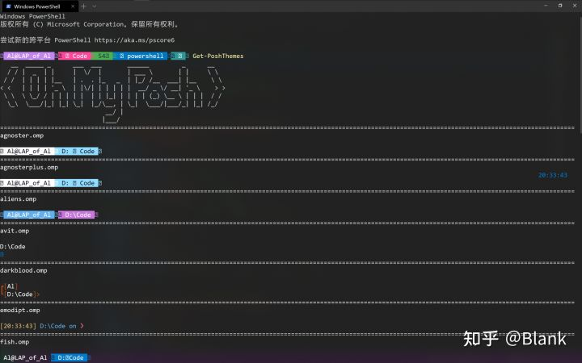
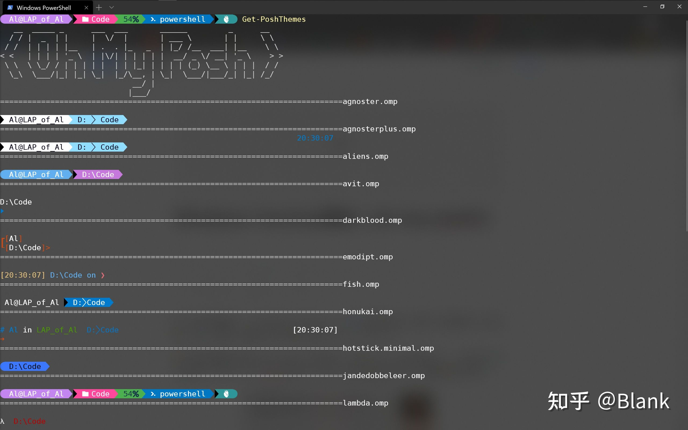
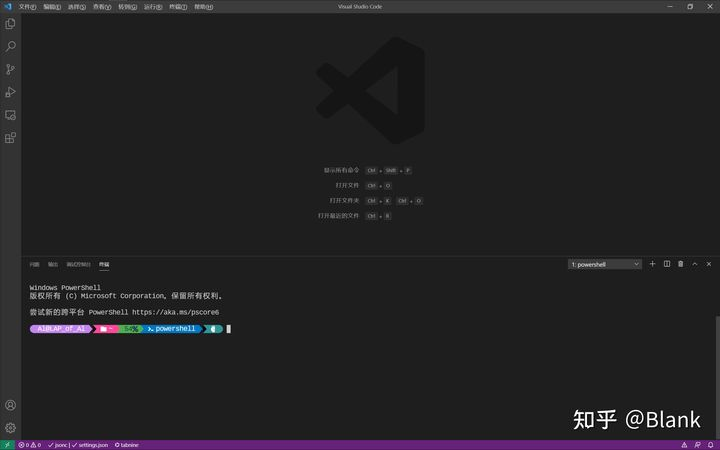

# Windows Terminal

## Oh my posh

前一段时间想美化一下Windows Terminal，无奈网上教程比较乱，美化中途也遇到了许多问题，于是，便想写一篇文章关于怎么美化Windows Terminal。

网上看到的教程大多数是关于oh-my-posh2的，现在oh-my-posh升级到3了，一些地方有些小的变化。关于oh-my-posh2的教程，[oh-my-posh的作者](https://github.com/JanDeDobbeleer)在GitHub已经讲的很清楚了 [oh-my-posh2](https://github.com/JanDeDobbeleer/oh-my-posh2)。

------

## 一.安装主题[[1\]](https://zhuanlan.zhihu.com/p/354603010#ref_1)

**1.首先**，先贴上oh-my-posh的官方文档：

[Home | Oh my Poshohmyposh.dev/](https://ohmyposh.dev/)

**2.然后**，想必各位都已经事先安装好了Windows Terminal，没安装好的到Microsoft store搜索“Windows Terminal”安装即可。

**3.**安装好之后，**使用管理员身份**打开Windows Terminal。安装oh-my-posh和posh-git。

- 第一条命令（绕过power shell执行策略，使其可以执行脚本文件<后面会用到>）

```text
Set-ExecutionPolicy Bypass
```

- 第二条命令（oh-my-posh提供主题）

```powershell
Install-Module oh-my-posh -Scope CurrentUser
```

- 第三条命令（posh-git将git信息添加到提示中）

```text
Install-Module posh-git -Scope CurrentUser
```

> **注意：如果中途有询问，直接Y就好了。**

------

## **二.编辑相应配置文件**[[2\]](https://zhuanlan.zhihu.com/p/354603010#ref_2)

**1.在Windows Terminal中敲下下面两行命令**

- 第一条（启动编辑power shell配置文件的引擎）

```text
if (!(Test-Path -Path $PROFILE )) { New-Item -Type File -Path $PROFILE -Force }
```

- 第二条（使用记事本打开配置文件）

```text
notepad $PROFILE
```

**2.在打开的记事本中写入如下内容**（***脚本文件\***）**，并保存**

```text
Import-Module posh-git
Import-Module oh-my-posh
Set-PoshPrompt -Theme JanDeDobbeleer
```

- 第一条命令表示导入posh-git
- 第二条命令表示导入oh-my-posh
- 第三条命令表示设置主题为JanDeDobbeleer

**配置完后**，每次打开Windows Terminal中的Power shell都会执行脚本文件中的三条命令。

```text
               #注意：此处的第三行是oh-my-posh2与3的不同之一，在oh-my-posh2里的是：
                                        Set-Theme XXXX
            #如果不是很喜欢这个主题，可以使用以下命令来查看所有主题以及主题的名称.omp
                                        Get-PoshThemes
            #找到喜欢的主题后，可以在之前的脚本文件中将主题名称替换为你想要主题的名称。
                            #注意：此处获取主题在oh-my-posh2的命令为：
                                          Get-Theme
```

> 这时，你会发现出现了一些方框，效果并不像图片上那么好。那是因为，还没有给主题安装适应的字体。



------

## **三.安装Nerd Fonts字体并应用**[[3\]](https://zhuanlan.zhihu.com/p/354603010#ref_3)

**1.安装字体**

- 进入[网站](https://www.nerdfonts.com/)
- 点击***Downloads\***
- 随便下载一款字体（但个人推荐<**DejaVuSansMono Nerd Font**>或<**Cousine Nerd Font**>，这两套字体比较全，适配也还不错。）
- 下载完成后，**解压**到当前文件夹，然后CTRL+A全选，右键点击**安装**，等待安装完成即可。

**2.使用字体**

- 打开windows terminal，并在上方**标签栏**点击下拉按钮找到**设置**，并点击，然后在左侧最下方点击打开JSON文件。
- 如果有**vscode**，将会在**vscode**中打开**settings.json**，这个就是**Windows Terminal**的配置文件。
- 这个配置文件最开始几行表示的是**架构**和**默认配置**。下面几行有3个包含着字典的列表，分别表示**快捷键（keybindings）、配置（profiles）、配色方案（schemes）**。而我们需要设置的地方在**配置（profiles）**中，在**profiles**中，我们能看到有多个字典，我们需要设置美化power shell，故找到字典中包含：

```json
"guid": "{61c54bbd-c2c6-5271-96e7-009a87ff44bf}"
```

这是power shell的全局唯一标识符（guid）。

- 找到后，将其中键为"fontFace"的键值对改为（如果没有fontFace就自己添加一下，放在guid下一行，记得加逗号）：

```text
// 文件名称
// DejaVu Sans Mono Nerd Font Complete.ttf
"fontFace": "DejaVuSansMono Nerd Font"
```

> 注意：此处字体的名称请参考上方[Nerd Fonts网站](https://www.nerdfonts.com/font-downloads)中的字体名称，否则无法显示出来。

- 设置好之后保存settings.json文件（若vscode未开启自动保存设置，可使用CTRL+S进行保存。）
- 完成之后重启Windows Terminal即可发现样式改变了，若未改变，请重启Windows Terminal。



------

## 四.在vscode中power shell样式（可选）

**1.使用 \*CTRL+，\* 是的，你没有看错CTRL+逗号打开vscode的设置**

**2.在顶部输入框输入以下字符：**

```text
Integrated:Font Family
```

**3.在所显示（Terminal › Integrated:Font Family）的输入框中输入（在我的电脑上Cousine Nerd Font适配比较好，不会出现偏移的现象）：**

```text
Cousine Nerd Font
```

**或**

```text
DejaVuSansMono Nerd Font
```

**4.使用 \*CTRL+`\* 召唤终端，即可看到样式发生改变，如果看不到，请重启vscode。**

成功配置Nerd Fonts的vscode

------
## 五.JetBrains
**1.Console Font 设置**

## 小结

Windows Terminal的美化到此结束，一顿操作下来，是不是比以前好看了不少？结束前还讲了下vscode的美化方法，让编写程序的时候能够获得额外的审美体验，岂不美哉？

------


## 参考

1. [^](https://zhuanlan.zhihu.com/p/354603010#ref_1_0)对GitHub上的oh-my-posh2安装做了一些修改 https://github.com/JanDeDobbeleer/oh-my-posh2#installation
2. [^](https://zhuanlan.zhihu.com/p/354603010#ref_2_0)oh-my-posh2升级到3过程中所发生的变化 https://ohmyposh.dev/docs/upgrading
3. [^](https://zhuanlan.zhihu.com/p/354603010#ref_3_0)在oh-my-posh2上，需要安装powerline字体。而在on-my-posh3上，有一些符号已经不支持了，所以需要安装Nerd Fonts字体（字符图标样式号称最全）。


