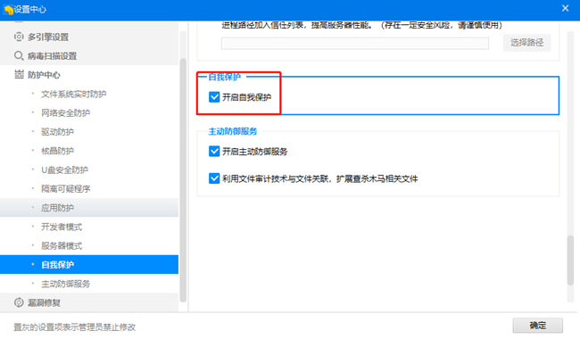

# 奇安信卸载

### 状态栏——奇安信——右键选择设置

### 防护中心——自我保护——取消勾选（关闭自我保护）

### 进入安装目录

*进入C:\Program Files (x86)\QAX\360Safe\EntClient\conf （请自行确认安装目录）*

   *文本编辑 EntBase.dat* 

   *修改uienable=0  qtenable=0*

   *保存*

### 控制面板卸载奇安信

